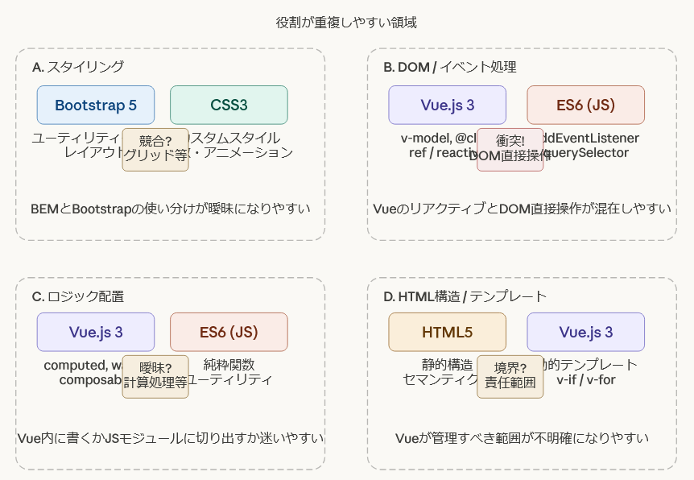

# フロントエンド開発標準

## はじめに
思想的背景については[general-coding-standard.md](general-coding-standard.md)を参照してください。

## 技術スタック
- HTML5
- ES6
- Vue.js 3
- Bootstrap 5
- CSS3

## 規約IDの解説
本ドキュメントの各規約には `X_XXXnnn` 形式のIDが付与されています。

- **第1部 (Type)**: `N` (Naming/命名規約), `C` (Coding/コーディング規約)
- **第2部 (Layer)**: `G` (General/共通), `H` (HTML), `C` (Style/CSS), `B` (Bootstrap), `J` (JavaScript), `V` (Vue.js), `T` (Tooling)
- **第3部 (Category)**: `NM` (NaMe), `MT` (ComMenT), `ST` (STructure), `PT` (PaTtern), `DM` (DoM), `LD` (LoaD), `RL` (RuLe)
- **第4部 (連番)**: `001` からの3桁連番

例: `C_GMT001` (Coding, General, Comment, 001)

---

## 命名規約 (N)

### 1. 基本・共通規約 (GNM)
- N_GNM001:☆☆☆ 名前づけは意味が伝わる英単語を使用し、省略語は極力避ける

### 2. マークアップ・スタイル命名 (HNM, CNM)
- N_HNM001:☆☆☆ HTMLの **ID** は `kebab-case` とする（CSSとの一貫性）
- N_HNM002:☆☆☆ HTMLの **クラス名** はCSSの規約に従う
- N_HNM003:☆☆☆ HTMLの **データ属性** は `data-kebab-case` とする
- N_HNM004:☆☆☆ HTMLの **要素名(いわゆるタグ)** は小文字で表記する
HTMLの規格としては大文字小文字の区別はなく、HTML4時代では大文字表記が慣習であったが、近年は小文字表記が主流であるため、これに倣う。

- N_CNM001:☆☆☆ CSSの基本スタイルは `kebab-case` とする（全て小文字、単語間をハイフン `-` で繋ぐ）
- N_CNM002:☆☆☆ CSSの変数は `--kebab-case` とする

### 3. スクリプト・コンポーネント命名 (JNM, VNM)
- N_JNM001:☆☆☆ JSの **変数・関数** は `lowerCamelCase` とする
- N_JNM002:☆☆☆ JSの **クラス名** は `PascalCase` とする
- N_JNM003:☆☆☆ JSの **定数** は `SCREAMING_SNAKE_CASE` とする（グローバルまたは不変な定数）
- N_VNM001:☆☆☆ Vueの **SFCファイル名** は `PascalCase.vue` とする（例: `UserProfile.vue`）
- N_VNM002:☆☆☆ Vueの **Props** は、JS内では `camelCase`、テンプレート内の属性バインドは `kebab-case` とする（例: `:user-id="id"`）
- N_VNM003:☆☆☆ Vueの **カスタムイベント** は `kebab-case` とする（例: `@update-status`）

### 4. 設計パターン (CPT)
- N_CPT001:☆☆ CSS設計手法として **BEM（Block Element Modifier）** を推奨
`block__element--modifier` の形式を使用する。
ただし、レイアウトについてはBootstrapを優先する(C_BRL001)ため、どうしてもBootstrapで表現できないカスタムCSSを採用する場合のルールである。

---

## コーディング規約 (C)

### 1. コメント規約 (MT)
- C_GMT001:☆☆☆ コメントはコードの目的を補足するものである
コメントの価値はコードを読んだだけではわからない「設計意図」を明示することにある。
「なぜ」このような処理になっているのか？　「なぜ」こうではない方法を選択しなかったのか？　の記載があることで読者の解像度は大きくあがる。

- C_GMT002:☆☆☆ わかりきったコメントは書かない
コメントが多ければ多いほど良いというのは幻想である。多すぎるコメントは可読性と保守性を下げる。そのコメントがなくてもコードが理解できる場合は書かない。

> **コメント不要の例**
> * $i++ ; //ループカウンタをインクリメント　・・・インクリメント演算子を使ってるのだから当然
> * return TRUE;  // 真を返す　・・・returnは戻り値の指定なので当然
> * コードは仕様書ではないので、処理そのものの動作説明は原則として不要である。可読性と保守性の低下を避ける。

- C_GMT003:☆☆☆ コードと矛盾するコメントを書かない
修正が重なった結果、最初に書いたコメントとコードの間に整合性がとれないようなことがあっては本末転倒である。

- C_GMT004:☆☆☆ コード内に修正者・修正情報・旧コードをコメントとして残さない
新しく書き直したソースのすぐそばにこうした情報を残す手法もあるが、基本的にはこうした情報はバージョン管理ツールにおいて実現すべき内容であり、ソースコードに直接書くことはしない。そのためのVCSでありgitである。
しかし、何らかの事情でバージョン・差分管理ツールが使えないとか仕様書が残せずソースコード内で履歴管理をしなくてはならない場合は許容される。この場合、プロジェクト管理者は可能な限り早くソースの差分管理のための環境を整備すべきである。

- C_GMT005:☆☆ コメントを書かなくてもわかるコードをめざす
* 命名規約を遵守することでオブジェクトの持つ役割・意味を明確化する。
* メソッド・関数の役割を可能な限り一意化するなど「役割は一つ」の原則を守る
これらの対応でコメントを書かなくても意図が明瞭になるコードを書くことでコメントの出番を減らすことができれば、総合的な負荷が下がる。
> *) 気持ちとしては☆☆☆。


- C_HMT001:☆☆☆ HTMLのコメント形式は `<!-- -->` (標準)とする
- C_CMT001:☆☆☆ CSSのコメント形式は `/* */` (標準)とする
- C_JMT001:☆☆☆ JavaScriptのコメント形式は `//` (標準)とする

### 2. 技術要素の責任分担
フロントエンド開発における様々な技術はそれぞれが独自の機能を持ち、対応可能な領域には重複が存在する。(図.責任境界の重複)

このためそれぞれが「何をしないのか」を明確にすることは、実装上の混乱減少に寄与する。
 A. スタイリング: C_BRL001
 B. DOM/イベント処理: C_JDM001
 C. ロジック配置: 
 D. HTML構造/テンプレート: C_HST001
(ToDo: 画像のABCDと章立てを同期させる＝画像の修正が必要)

### A. スタイリング
- C_BRL001:☆☆☆ Bootstrapで表現可能なレイアウト・スタイルは独自CSSで再実装しない。
 * Bootstrapのクラスを積極的に使用し、独自のスタイル定義を最小限に抑える
 * グリッドシステムはBootstrapの標準クラスを使用して構築する

### B. DOM/イベント処理
- C_JDM001:☆☆☆ DOMはVueに管理させ、原則として直接操作しない（リアクティブシステムへの委任）
- C_JDM002:☆☆ DOM操作が必要な場合は、`onMounted` 以降で実行する
- C_JDM003:☆☆☆ DOM要素自体にアプリケーションの状態（データ）を保持してはならない

### C. ロジック配置
- C_GST001:☆☆☆ 業務ルールはバックエンド層に集約する
MVCの責任分担を鑑み、モデルに相当する業務ルール（ビジネスロジック）は原則としてバックエンド層にて実装する。
フロントエンドに業務ルールを実装してはならない（例外は明示的に許可された場合のみ）。

- C_VST001:☆☆☆ アプリケーションロジックはVueから分離する
Vueは状態管理とUI制御を担う層とし、データ加工・API通信・状態遷移などのアプリケーションロジックはES6モジュールとして分離する。


#### D. HTML構造/テンプレート
- C_HST001:☆☆☆ HTMLは構造を定義する
セマンティックな構造を記述する（header, main, sectionなど）
見た目や振る舞いをHTMLで表現しない。

- C_HST002:☆☆☆ HTMLヘッダの宣言部は以下のテンプレートを使用する
```html
<!DOCTYPE html>
<html lang="ja">
<head>
  <meta charset="UTF-8">
  <meta name="viewport" content="width=device-width, initial-scale=1.0">
  <title>タイトル</title>
</head>
```
- C_JLD001:☆☆ ビルドツール（Vite等）を使用する場合、scriptタグの直接管理を行わない
- C_JLD002:☆☆ scriptタグを直接記述する場合は `<body>` の末尾に配置するか、`defer` を付与する


### 3. 実装に関する規約
- C_JRL001:☆☆☆ 変数はletを使用する
変数スコープを確実に制御するために、変数設定はletを使用し、varは使用しない。
これにより、意図しない変数の巻き上げや再宣言を防ぐ。

- C_JRL002:☆☆☆ 定数はconstを使用する
再代入の必要がない変数設定はconstを使用する。これによりコードの可読性が向上し、意図しない再代入を防ぐことができる。


---

## AI活用について
本規約は、複数のAIツール（Claude, ChatGPT, Gemini）の支援を受けて開発されました。 